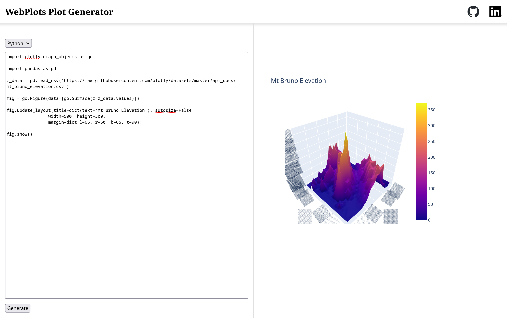

# WebPlots Plot Generator

WebPlots is an Angular web application that runs scrips in Python and R to generate and present visualizations.

For examples of plotting scripts, see [examples.md](assets/examples.md).

## Libraries Supported

### Python

1. Plotly
2. Matplotlib

### R

1. Plotly
2. GGPlot2

## Tech Stack

1. Angular
2. Docker
3. Flask
4. Plotly.js

## Design Description

The backend runs a docker container that listens on routes `/r_runner` and `/python_runner` endpoints for `POST` requests and executes the contained script as a subprocess.

The output fromm the script is saved as a plotly figure, including conversions from other libraries if needed, and the link to the figure is sent as the response.

The frontend uses an iframe with a blank target at the start. This iframe is updated to the link from the backend when the response is recieved.

## Issues Encontered

1. Scripts in R fail due to not being able to find common dataset libraries. Mitigated by pre-installing a wide array of libraries.
2. Matplotlib threw errors about having no graphical screen when `plt.plot()` was called. Solved by prepending `matplotlib.use('Agg')` in the script so that the non-graphical plotting backend is used.
3. Since the frontend and backend were running on the same host(localhost) but the servers were different, the Cross-Origin Resource Sharing (CORS) policy was blocking connections to the backend. This was solved by using the `CORS` module from flask.

## Working Video

